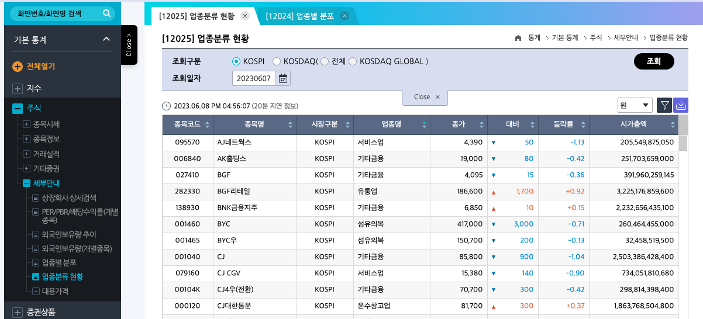
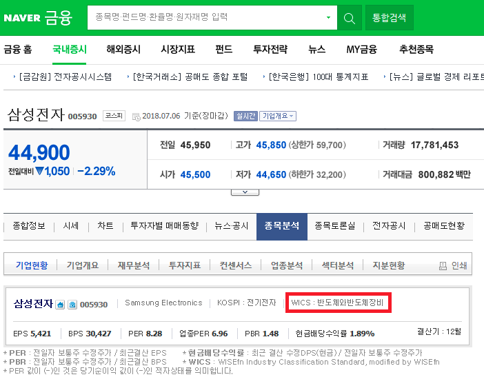

# 국내주식
## [업종분류](https://m.blog.naver.com/clean820818/221300200224)
### [1. 코드피 업종 분류 방법](https://daamsaego.tistory.com/entry/%EC%BD%94%EC%8A%A4%ED%94%BC-%EC%BD%94%EC%8A%A4%EB%8B%A5-%EC%A2%85%EB%AA%A9%EB%8D%B0%EC%9D%B4%ED%84%B0-%EC%A2%85%EB%AA%A9%EC%BD%94%EB%93%9C-%EC%97%85%EC%A2%85-%EB%8B%A4%EC%9A%B4%EB%A1%9C%EB%93%9C-%EB%B0%A9%EB%B2%95)
[1-1. 한국거래소|정보데이터시스템 이동](http://data.krx.co.kr/contents/MDC/MDI/mdiLoader/index.cmd?menuId=MDC0201020506)      
1-2.주식|세부안내|업종분류 현황 이동       

### [2. WICS](https://www.wiseindex.com/About/WICS)

# 주식데이터 수집
- https://seong6496.tistory.com/169

# 참고 문서
- https://www.youtube.com/@wsaj
- https://www.youtube.com/@haltoo
- https://stock79.tistory.com/
- [파이썬 멀티프로세싱](https://inhovation97.tistory.com/55)
