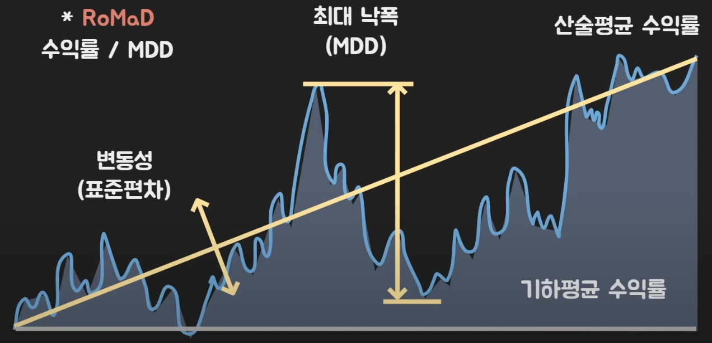
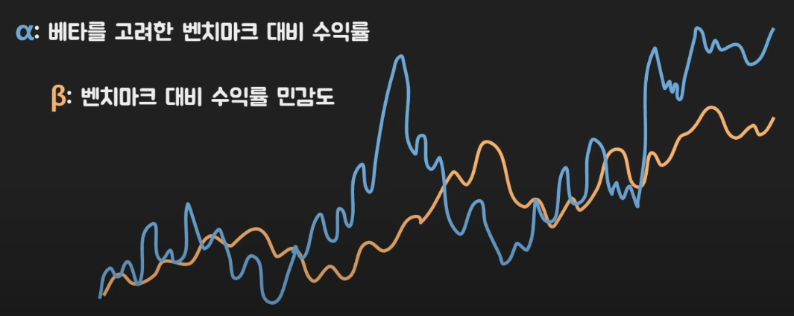
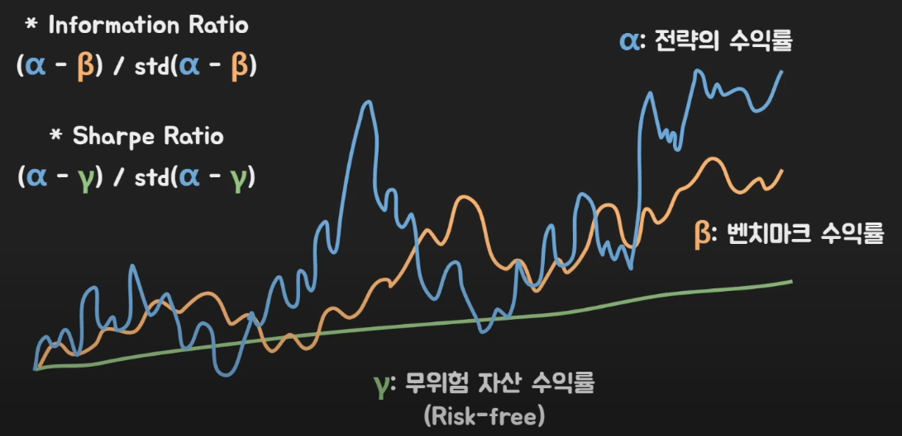

# [시스템 트레이딩](https://www.youtube.com/watch?v=JAUVb_73RQY)

## [Backtesting](https://marinelifeirony.tistory.com/157)
과거 특정 시점부터 데이터를 받아 매매를 진행하고 그 결과에 따른 계좌의 자산 변화를 확인하는 벡테스팅을 통해 평가한다.
- [Backtrader](https://github.com/mementum/backtrader)
- [backtesting](https://github.com/kernc/backtesting.py)

## metric
### 용어
- 변동성(표준편차)
- 최대 낙폭(MDD)
- [평균 수익률](http://www.dentalnews.or.kr/news/article.html?no=30106)
    - 산술평균(arithmetic mean) = N개의 변수를 모두 합한 후 N으로 나눈 값
    - 기하평균(geometric mean) = N개의 변수를 모두 곱한 후 N으로 제곱근 한 값

- $\alpha$: 얼마나 시장보다 잘하는지 
- $\beta$: 얼마나 시장과 비슷하게 가는지 

### Metric 지표 
- RoMaD
    - 수익률 / MDD
- Information Ratio
    - 벤츠마크 수익률과 비슷하면서 얼마나 더 큰 수익(또는 시장을 이겨낼 수 있는지)에 대한 지표
- Sharpe Ratio
    - 무위험 자산 수익률과 비교하여 변동성(위험) 대비 얼마나 더 큰 수익을 낼 수 있는지에 대한 지표 

# 참고문서
## 트레이딩 시스템
- [시스템 트레이딩을 위한 데이터 싸이언스](https://wikidocs.net/book/486)
- https://joycecoder.tistory.com/category/%EC%A3%BC%EC%8B%9D%20%EA%B3%B5%EB%B6%80
## 기타
- https://qraftec.com/insights-korean/2019/3/6/-
- https://keraskorea.github.io/posts/2018-10-25-Keras%EB%A5%BC%20%ED%99%9C%EC%9A%A9%ED%95%9C%20%EC%A3%BC%EC%8B%9D%20%EA%B0%80%EA%B2%A9%20%EC%98%88%EC%B8%A1/
- https://wendys.tistory.com/181
- https://pandas-datareader.readthedocs.io/en/latest/index.html
- https://financedata.github.io/marcap/